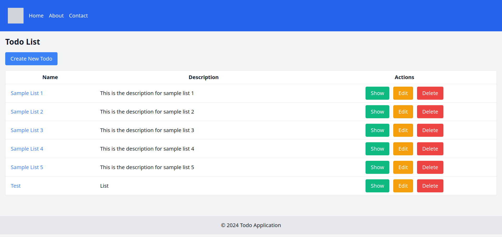

# TODO Application

This is a TODO application. This simple app is an exploratory attempt to create a kit to develop microservices and self-contained apps.



## Overview
This is a sample app using the common example of a todo list. The example is designed to express the desired outcome for the generator library. Currently, there is some repetition because we are implementing the same functionality using different approaches: resource-based with RESTful routes and feature-based, which is implemented in a command-query style (though not pure CQRS as commands will return a meaningful response). 

Feature-based implementation allows operating on several resources (a list and item in this particular case) and all are handled through this command-query interface.

## Configuration
### Command-Line Flags
You can pass the following flags to the application:  
```txt
server.web.host: Host for the web server (default: localhost)
server.web.port: Port for the web server (default: 8080)
server.api.host: Host for the API server (default: localhost)
server.api.port: Port for the API server (default: 8081)
```

### Environment Variables
The same configuration can be set using environment variables. The environment variables should be prefixed with TODO_ and use underscores instead of dots. For example:  
```shell
TODO_SERVER_WEB_HOST: 127.0.0.1
TODO_SERVER_WEB_PORT: 8080
TODO_SERVER_API_HOST: 127.0.0.1
TODO_SERVER_API_PORT: 8081
```

## Usage
### Running the Application

Using environment variables:
```shell
export TODO_SERVER_WEB_HOST=127.0.0.1
export TODO_SERVER_WEB_PORT=8080
export TODO_SERVER_API_HOST=127.0.0.1
export TODO_SERVER_API_PORT=8081
./todo
```

Using command-line flags:

```shell
./res -server.web.host=127.0.0.1 -server.web.port=8080 -server.api.host=127.0.0.1 -server.api.port=8081
```
