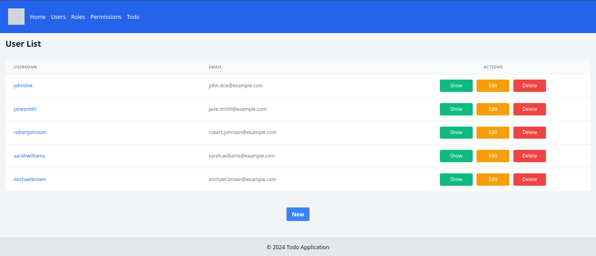

# TODO Application

This is a TODO application. This simple app is an exploratory attempt to create a kit for developing microservices and self-contained apps.

This reference app is designed to showcase the features and patterns that the kit generator should later replicate for other specific projects.




> **Is development on this project halted? Not at all.**  
> A more realistic use case has emerged, and any progress made on [Hermes](https://github.com/adrianpk/hermes) will be retrofitted back into here, and, in turn, into Aquamarine. Many fronts open, just one person executing.

## Overview
This is a sample app using the common example of a todo list. The example is designed to express the desired outcome for the generator library.

The generated code exposes its features primarily through a command-query interface, with features organized in separate packages under `feat`. Each feature (a set of resources managed by a service and exposed through various interfaces such as web, API, gRPC, CLI) is contained within a single package under `feat` (one feature per package). This is the default and recommended approach for most use cases.

For simple cases where a client needs to manage basic CRUD operations, a RESTful interface can also be generated, with resource entities defined under a directory hanging from `res`. The RESTful endpoints will be accessible under a configurable path prefix (defaulting to `/res` if none is provided), followed by the resource name. This is a special case approach, useful for simple CRUD operations or to interface with more traditional clients.

Although we refer to command-query, it is not in the pure CQRS sense; commands will return a response. Ideally, each feature should handle a single bounded context, and interactions with other features should be done through mechanisms other than direct method calls. This approach is intended to facilitate decoupling and potential future separation into distinct services. Organizing the code this way and avoiding direct coupling between features makes it easier to transition to a microservices architecture if required at some point. While this is the recommended approach, developers can modify the code as needed. Synchronous operations via gRPC or asynchronous methods such as pub/sub, queues, etc., are viable options. The kit will provide appropriate interfaces and some specific implementations to simplify this operatory.

Additionally, the kit aims to address observability and monitoring concerns by providing hooks and eventually some implementations to facilitate these aspects.

## Expected Features
- [ ] Web
- [ ] JSON API
- [ ] RESTful support
- [ ] Command-Query support
- [ ] Sync and Async inter-feature communication (gRPC / NATS)
- [ ] Server-Side Rendering (SSR) 
- [ ] htmx 
- [ ] Flag and environment variable configuration
- [ ] Pub/Sub
- [ ] SQL (SQLite3 / PostgreSQL)
- [ ] Assets processing pipeline
- [ ] Containerization and orchestration ready
- [ ] More to come...

These features will be included in this TODO example app and will later become part of the kit.

## Configuration
### Command-Line Flags
You can pass the following flags to the application:  
```txt
server.web.host: Host for the web server (default: localhost)
server.web.port: Port for the web server (default: 8080)
server.api.host: Host for the API server (default: localhost)
server.api.port: Port for the API server (default: 8081)
```

### Environment Variables
The same configuration can be set using environment variables. The environment variables should be prefixed with TODO_ and use underscores instead of dots. For example:  
```shell
TODO_SERVER_WEB_HOST: 127.0.0.1
TODO_SERVER_WEB_PORT: 8080
TODO_SERVER_API_HOST: 127.0.0.1
TODO_SERVER_API_PORT: 8081
```

## Usage
### Running the Application

Using environment variables:
```shell
export TODO_SERVER_WEB_HOST=127.0.0.1
export TODO_SERVER_WEB_PORT=8080
export TODO_SERVER_API_HOST=127.0.0.1
export TODO_SERVER_API_PORT=8081
./todo
```

Using command-line flags:

```shell
./todo -server.web.host=127.0.0.1 -server.web.port=8080 -server.api.host=127.0.0.1 -server.api.port=8081
```

## Notes
~~There is significant repetition due to the decision to use composition and delegation for providing core functionality to various entities.
While this could be avoided by using embedding, the intention would not be as explicit. 
For now, we will stick to this approach. If embedding becomes a more sensible option in the future, we can test it out.~~

Having experimented with composition, it has become evident that its benefits in explicitness are minimal or negligible and always come at the cost of redundancy. Embedding eliminates this, reducing code clutter.
The methods provided by these embedded interfaces and structs seamlessly integrate, offering essential logging, configuration, and lifecycle management capabilities.
Given these advantages, embedding will be adopted moving forward.

[What about testing?](https://htmx.org/essays/prefer-if-statements/#:~:text=Implementation%20Driven%20Development,drive%20that%20test)
